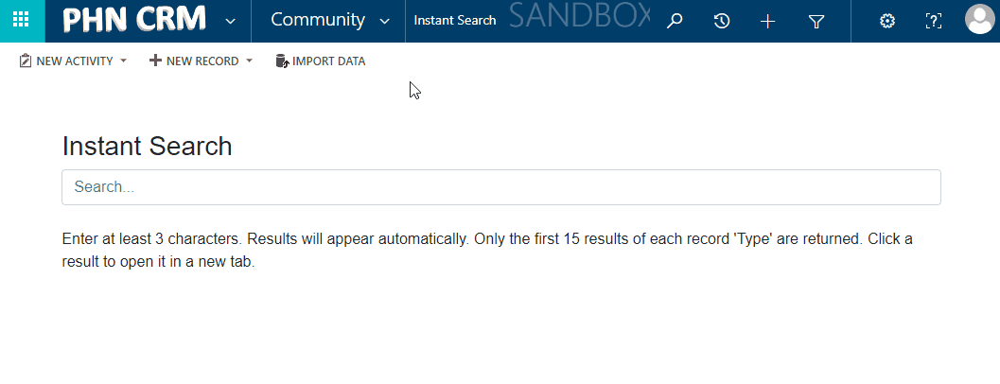

# Asset Register

## Overview

The 'Asset Register' is a component comprised of the following entities:

- [Device](/entities/device)
- [Device Allocation](/entities/device-allocation)
- [Software](/entities/software)
- [Software License](/entities/software-license)
- [Software Allocation](/entities/software-allocation)

These 5 entities allow your PHN to:

- Manage a list of devices (serial numbers)
- Manage device allocations
- Find unallocated devices
- See total number of devices, by type (laptop / desktop / mobile)
- See allocation history for each device
- List of software relevant/used by your PHN
- Manage software licenses
- See history of software license allocations
- More