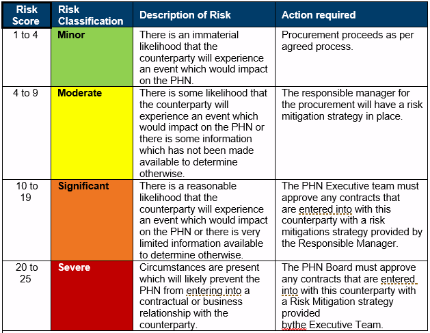
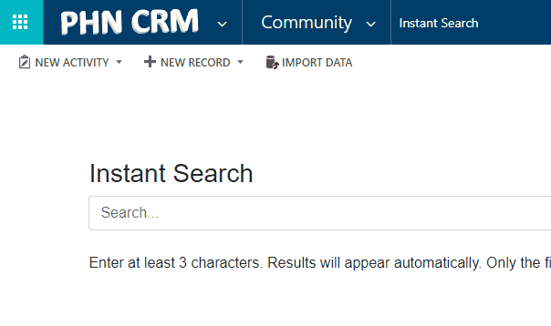
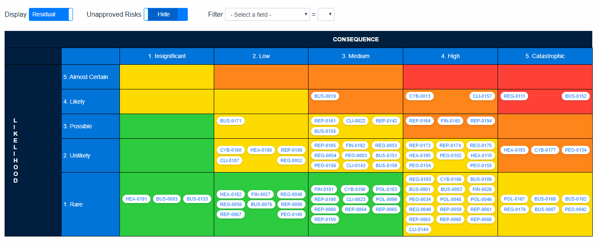
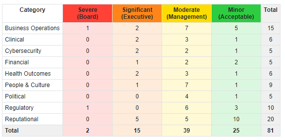
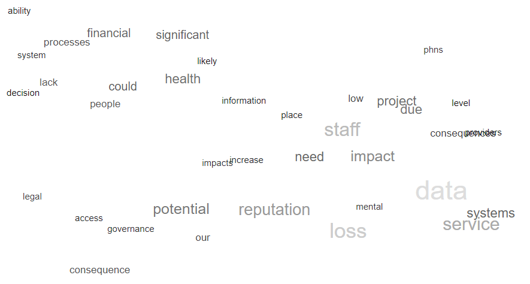
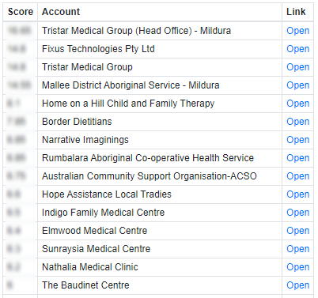

# Enterprise-wide Risk Framework

## Overview

Enterprise-wide Risk Management is about identifying risk that could impact your PHN enterprise, in the pursuit of strategic goals​.

## Risk Assessments

Risk is the likelihood and effect/consequences of uncertainty on business objectives – anything which may potentially cause performance variance from company objectives.

Your PHN CRM has built-in tools to allow you to identify, assess, escalte, mitigate and report on your risks.

### Risk Categories

- People & Culture​
- Clinical​
- Health Outcomes​
- Political​
- Reputational​
- Legal / Regulatory​
- Financial​
- Business Operations​
- Cybersecurity

## Counter-Party Risk Assessments (CPRA)

Assessing your counter-party risk.

As a minimum, counterparty risk assessments are to be commenced or updated:

1. Upon a counterparty submitting information to Murray PHN during a procurement process.
2. Upon a counterparty submitting information to Murray PHN on voluntary basis.
3. Upon Murray PHN receiving additional information on an existing counterparty from another
source.
4. Upon a contract escalating to an amber or red risk.
5. During an annual review of a counterparty

The tool focuses on the five (5) key identified risk themes:

- Strategic Alignment
- Service Delivery
- Regulatory and Accreditation
- Financial
- Reputation

The Counterparty Risk Assessment Tool has a notes and attachment section in the file for each account that should be used to keep a copy of any documentation applicable to all assessments.

The resulting risk score will determine specific actions that are required, refer to table below:

_Please note: Refer to the Counterparty Risk Assessment Policy for examples of risk mitigation strategies that can be put in place._

### Regular reviews

The Counterparty Risk Assessment procedure is a cyclical process that requires constant evaluation
and updating. To this end, the procedure is to be repeated on an annual basis and where new market
intelligence comes to light and comes to the attention of Murray PHN staff members. 

## EwR Dashboard

Your PHN CRM has a built-in dashboard that gives your team a high-level snapshot of all Risks entered in the system.

The EwR Dashboard can be accessed in the _Business_ Area.

### Risk Matrix

The Risk Matrix sorts all the Risk records onto a matrix (likelihood & consequence). Each Risk is displayed as a 'bubble' with its ID shown. Hovering over a 'bubble' allows you to see both inherent and residual risk rating, as well as the name of the Risk. Clicking a 'bubble' opens that Risk in a new winow.

Using the provided filters, you can:

- Display risks using Inherent or Residual risk ratings
- Show or hide unapproved Risks
- Filter by Category, Location, Created By, Owner, Effectiveness of Mitigation, Consequence & Likelihood

You may also print the Risk Matrix using the 'print' button, or you may manually 'snip' a screenshot of the Matrix to include in reports.

### Summary Table

The Summary Table provides a breakdown of your Risks by category and rating.

### Word Cloud

The Risk Word Cloud calculates the number of occurences of each word used to define Risks, and then displays the most common words in a 'cloud'. The larger the word is displayed, the more commonly it is used. This tool demonstrates which topics or themes are dominating Risk in your PHN.

### Counter-Party Risk

The Counter-Party Risk tab displays all CPRAs in descending score. Click 'Open' to view/edit that CPRA in a new window.

(Names and order in screenshot are for example only)
