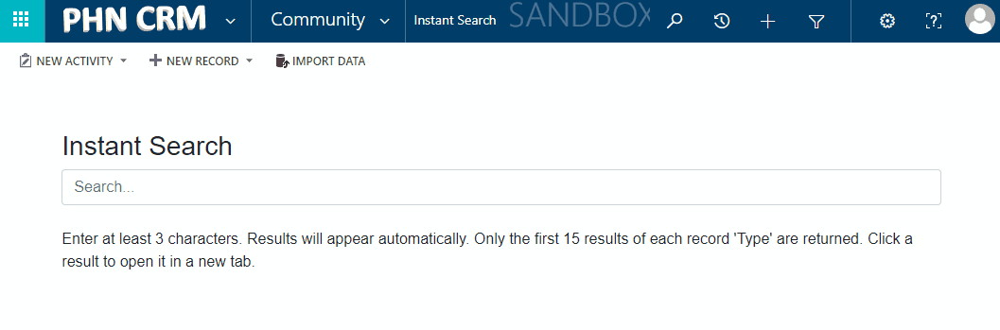
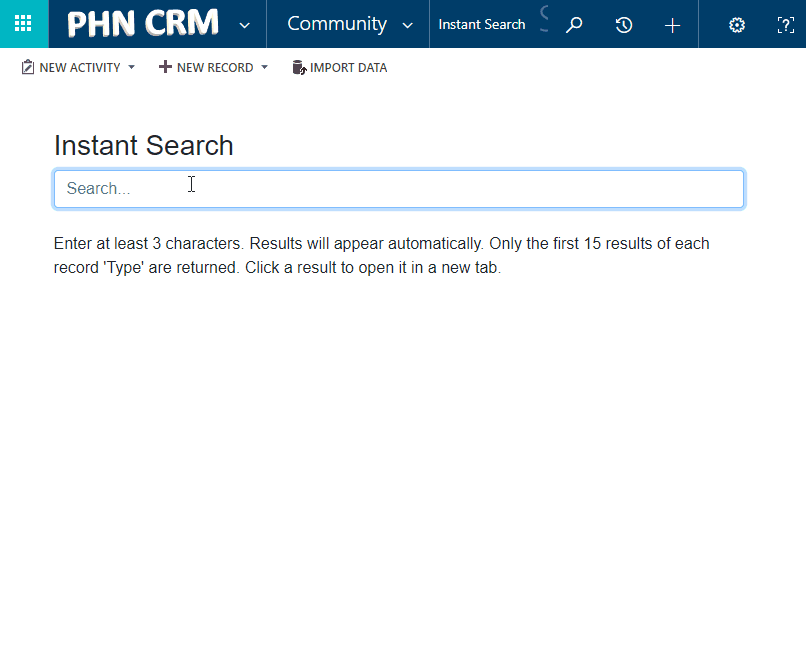

# Instant Search

You can get to Instant Search in the 'Community' Area, or from anywhere you can click the CRM logo (top-left):

- More user-friendly that the built-in search features.
- Search for records in CRM.
- Shows results as you type.
- Includes entities such as Accounts, Contacts, Users, Risks, Controlled Documents, Legislation, Software, Devices, etc.

Demonstration:

