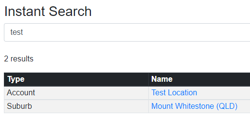

# Instant Search

- More user-friendly that the built-in search features.
- Search for records in CRM.
- Shows results as you type.
- Includes entities such as Accounts, Contacts, Users, Risks, Controlled Documents, Legislation, Software, Devices, etc.

You can get to Instant Search here, or from anywhere you can click the CRM logo (top-left):

Example of a search:

