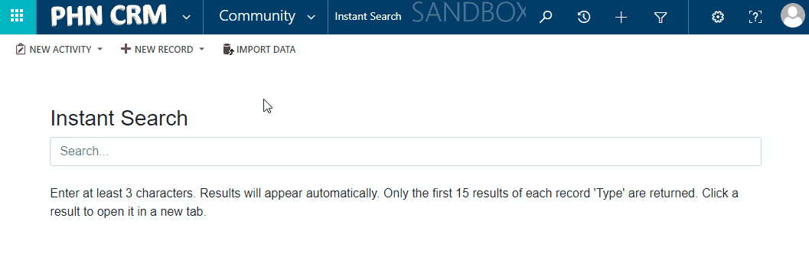
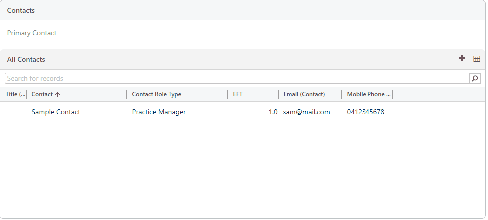
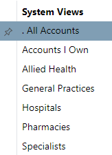

# Account 

Account records contain information about the companies you do business with.

The general concept is that the account is a single location and the contacts related to the account are those who work at that location. Accounts can be related to each other such as one account is headquarters (parent account) and sub-accounts are the multiple locations.

## FAQ

**How are organisations (accounts) categorised?**

> An organisation (account) has a field called 'Account Types', which contains values such as 'General Practice', 'Hospital', 'Specialist', 'Allied Health', 'Pharmacy' etc. Using this field you can filter accounts to show just 'General Practices'.

## Fields

| Field Name     | Field Description                                          |
| -------------- | ---------------------------------------------------------- |
| Managed by this PHN | Yes/No, whether this Account is managed by this PHN. Accounts not managed by the PHN are excluded from many reports. |
| Owner | The User at the PHN who owns the account record. In the case of General Practices, this should be the Practice Coordinator responsible for the practice. | 
| Account Name   | Name of the account (internal)    |
| Legal Name     | Legal name of the account/entity (usually what is shown on ABR) |
| Abbreviation | Abbreviated name of the account |
| Account Types | Multi-select field containing types of accounts |
| Services Provided | Multi-select field that mirrors the NHSD (National Health Services Directory) |
| ABN | Australian Business Number |
| Website | Public web address |
| IP Address | IP Address/es of this account |
| Primary Contact | The Contact record that is the main point of contact regarding this account |
| Address 1 | Physical address |
| Address 2 | Postal address |
| Suburb (Code) | This is the code of the Suburb (SSC) the Account is located in. You can search for the Suburb name. Alternatively, click the 'Auto-fill' button to have this filled automatically. |
| Parent Account | The parent Account record (e.g. The account representing the head office) |

(Some fields are not listed)

There are extra fields available if the Account has 'General Practice' in its Account Types. These fields are described in the [GP Profile section.](/components/gp-profile/)

## Form

### Contact Roles

In the 'Summary' tab is a grid which displays Contacts who have a Role at this Account. Each record in the grid is known as a 'Contact Role'.

[Learn more about Contact Roles.](/entities/contact-role)

## Views

The default views are shown below. Your CRM will likely have additional views available.

