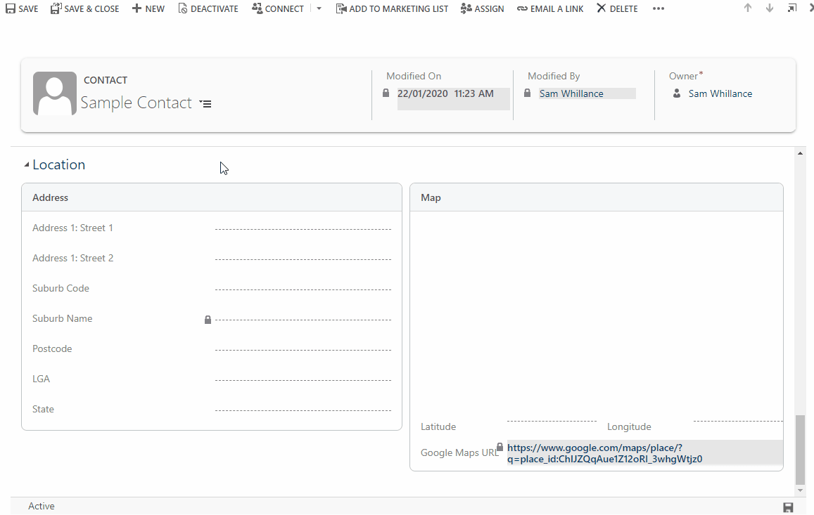

# Contact

Contacts are individual people with whom you have a relationship. Often contacts are related to an account.

Contacts integrate with the contacts in Microsoft Outlook, so it is important to understand that when fields on the contact record are updated, that change may synchronize to Outlook for one or more users depending on synchronization settings.

## Form

### Summary

### Communication

### Location

The Location tab displays fields for storing the location of a Contact. 

The field 'Suburb Code' is a *lookup field*. Search for (by name) a Suburb and select the matching record.

The fields 'Postcode', 'LGA' and 'State' are automatically filled by the system when the 'Suburb Code' is changed.

A Google Map showing the address information is shown on the right.

