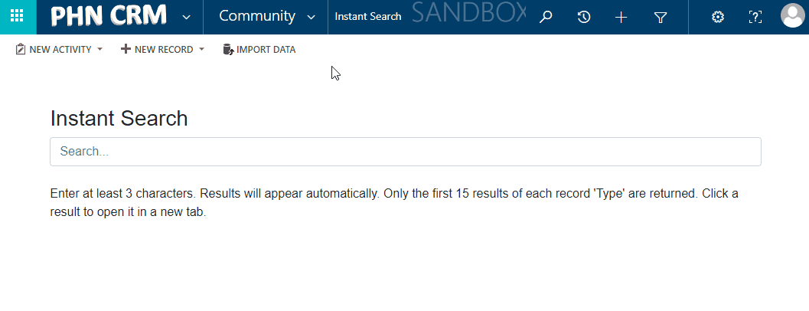

# Device Allocation  

## Overview

The 'Device Allocation' entity is part of the [Asset Register](/asset-register) component. It represents an allocation of a [Device](/entities/device). This allows staff to manage their [Devices](/entities/device), search for unallocated [Devices](/entities/device), see who previously used a [Device](/entities/device), when a [Device](/entities/device) was returned.

## Fields

| Field Name        | Field Description                                          |
| ----------------- | ---------------------------------------------------------- |
| Device            | The [Device](/entities/device) record                |
| User              | The [User](/entities/user) the Device is allocated to |
| Status            | Status (allocated, missing, etc.)                 |
| Allocated Date    | The date the device was allocated  |
| Expected Return   | The date the device is expected to be returned |
| Returned On       | The date the device was actually returned |

## Form

## Views

