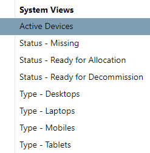

# Device 

## Overview

The 'Device' entity is part of the [Asset Register](/asset-register) component. It represents a single device with a unique serial number.

## Fields

| Field Name        | Field Description                                          |
| ----------------- | ---------------------------------------------------------- |
| Serial Number     | Unique serial number of the device                |
| Type              | Type of the device (Laptop / Device / Phone)      |
| Make              | The make (brand) of the device                    |
| Model             | Model number of the device                        | 
| Status            | Status (allocated, missing, etc.)                 |
| Network ID        | Device ID as shown on the network                 |
| IMEI              | The International Mobile Equipment Identity is a unqiue number to identify mobile phones |
| Location          | Where the device is currently located        |

## Form

### Allocation History

The 'Allocation' grid shows a historical record of Users who have had this device allocated to them.

## Views

