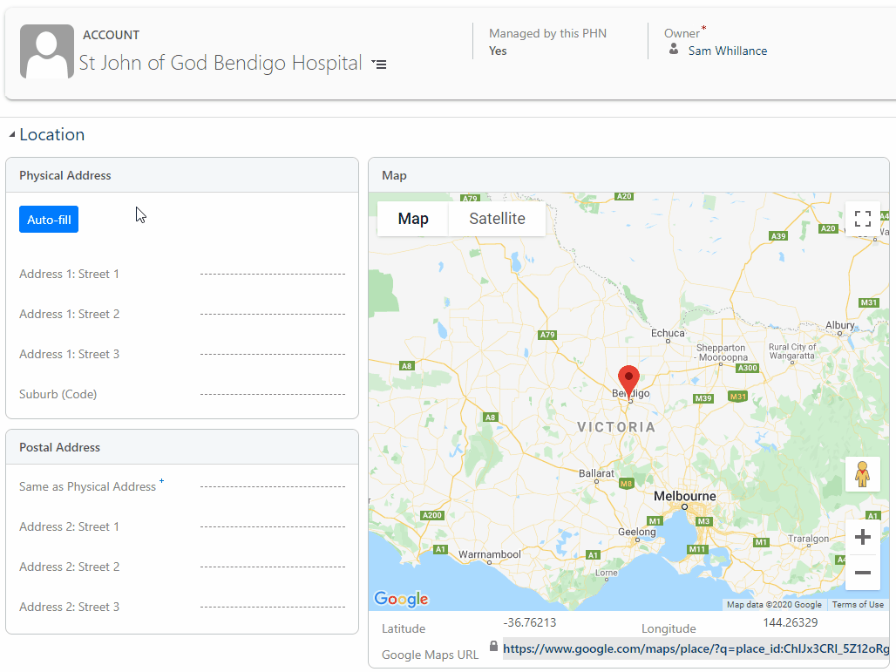

# Geographical Entities 

## Overview

PHN CRM contains thousands of records that each represent a single geographical boundary of a type.

The following boundaries are included:

- STE (States)

- SSC (Suburbs)

- POA (Postcode)

- PHNs

- SA4 (Statistical Area Level 4)

- SA3 (Statistical Area Level 3)

- SA2 (Statistical Area Level 2)

- SA1 (Statistical Area Level 1)

- LGA (Local Government Area)

- CED (Commonwealth Election Division)

- SED (State Electoral Division)

[ABS Descriptions](https://www.abs.gov.au/AUSSTATS/abs@.nsf/Lookup/1270.0.55.001Explanatory%20Notes1July%202016)

The physical boundaries of each area of each type are visible in CRM on an interactive map.

Some boundary types are linked to others. For example, you can see a list of SA1s contained in an SA2. POA (Postcodes) are linked to SSCs (Suburbs) and Suburbs are linked to LGAs. This linkage of data increases reporting capabilities.

Each area also has a direct link to the 'ABS Quick Stats' page for that area, which provides additional detailed demographics.

## Forms

All GEO-based entities have a similar set of fields, similar forms and views. All GEO entities will display an interactive map with the physical boundaries displayed.

Fields typically are:

- Name
- Code (defined by Australian Government)
- Related GEO entities (e.g. LGA, State)
- Direct URL to the record in ABS Quick Stats. This displays more detailed demographic information.
- Area (km2), elevation, population, density, median income, are sometimes included

Different GEO entities will also display grids on the form which display lists of other GEO entities that are within the currently opened record. For example, when you open a POA record a list of Suburbs are shown. These are Suburbs that use that postcode.

If you open an SSC (Suburb) record you will be given a list of Accounts within that Suburb.

A Form for POA 2640 is shown below.

## Address Auto-Fill

With one click, the system can locate the address of an Account and automatically fill in which SSC, POA, LGA, SA1-4 that Account resides within.

This provides several significant benefits:

- Find and export all Accounts within an LGA (you can filter by Account Type, e.g. General Practice).
- Consistent, accurate data: Suburbs are not misspelled. Accounts are not placed in the wrong areas which means they can miss out on funding.
- See total number of Accounts within an area.

When clicked, CRM will query Google for the matching address. When confirmed by the User, complex code will then use the latitude and longitude values of the address to find exactly which SA4, SA3, SA2 and SA1 that coordinate sits within.

See it in action below:

## Extracting Data

Some example reports:

- All Accounts within SA4 with code '202'
- General Practices (Accounts) within the SA3s '10304', '10704', '10801'
- All Accounts within Suburbs that have population less than 200
- General Practices that have an After Hours service within Gennawarra LGA

## Map Exporter Tool

Please see the [Roadmap](/roadmap).