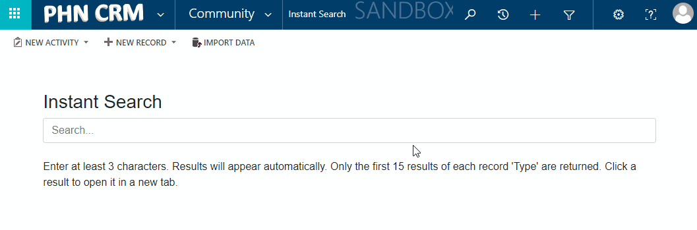

# User 

Users in Microsoft Dynamics 365 are individuals who have specific logins and passwords and a set of attached privileges at various access levels.

## Adding Users to CRM

To add a User to CRM:

1. In your [Azure Active Directory Admin Centre](https://admin.microsoft.com/Adminportal/Home?source=applauncher#/users), select the User you wish to add to CRM.

1. In 'Licenses & Apps', assign a 'Microsoft Flow Free' license.

1. Then go to ['Groups'](https://admin.microsoft.com/Adminportal/Home?source=applauncher#/groups). Select the 'Dynamics' group. Add the User to the group. Click 'Save/Apply'.

1. Within 1-10 minutes the =User will appear in CRM. The new User will have the most basic Security Role which they inherit from the default Team within CRM.

1. Open the User in CRM. Expand the 'Administrator' tab in the User form. Click the 'Mailbox' to open it.

1. Click 'Approve Email' and then 'Test & Enable Mailbox'. Refresh the page until 3 successes.

Further: [How to install 'Dynamics 365 App for Outlook' addin.](/app-for-outlook/#adding-the-app-to-outlook)

## Assigning Security Roles

[Guide on assigning Security Roles](/sec-roles/#assigning-security-roles)